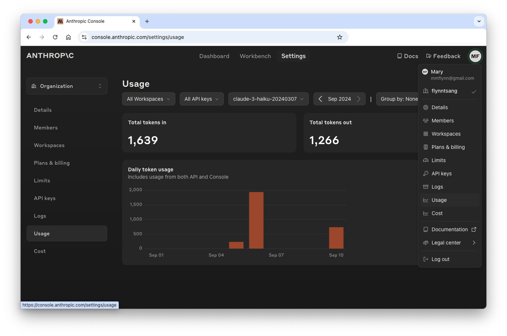

With Eidolon, you don't have to write and maintain your own code to use popular LLMs. Switching from ChatGPT to Claude or Mistral, for example, can be a simple matter of overriding a default attribute in a YAML file. 

>Before you begin: see [How to Authenticate with Your LLM](/docs/howto/authenticate_llm) for LLM-specific requirements.

## The Foundations

Eidolon agents are usually powered by Agent Processing Units (APUs). APUs expose attributes, such as which LLM(s) to use. APUs make it possible to separate the very important but highly leverageable agent code from the specifics of your implementation. 

You configure attributes in YAML files, which you'll find in your application's `resources` directory. 

### Know the Default Settings

To make it easy to get started, Eidolon provides built-in components that reference a popular LLM. You can override the defaults for specific agents, or set new global defaults for your environment. 

Defaults are set at various levels and can be inherited through reference.

**Agent:** [SimpleAgent](https://www.eidolonai.com/docs/components/agents/overview )
- **APU:** [ConversationalAPU](https://www.eidolonai.com/docs/components/apu/overview)<br>
  - **LLMUnit:** [OpenAIGPT](https://www.eidolonai.com/docs/components/llmunit/overview )<br>
    - LLM implementation: OpenAIGPT
    - LLM model: gpt-4-turbo
    - LLM connection handler: OpenAIConnectionHandler

  >Note: these defaults may change over time.

### Where and How to Make Changes

**Where:** Each Eidolon application has a `resources` directory to contain configuration files. 

**How:** Customizing agents is simply a matter of configuring the _specable_ attributes in text-based YAML files. 

>The [APU documentation](https://www.eidolonai.com/docs/components/apu/overview) shows what attributes are exposed as _specable_ and how they should be nested within your YAML files. (A `spec` is a <a href="https://docs.pydantic.dev/latest/concepts/models/" target=_blank>Pydantic model</a>.)
## Override the Default APU

You can configure agents to use different LLM providers and LLM models. This way your AI applications can be optimized to use the best model for each agent job.
### Reference a Different Built-In APU

If you want an agent to use a different LLM provider, start by referencing a different APU. 

Check the [APU components](/docs/components/apu/overview) documentation for a list of built-in APUs.

>Before switching LLMs, see [How to Authenticate with Your LLM](/docs/howto/authenticate_llm) to fulfill prerequisites for working with various LLM providers.

To override the default APU on an agent-by-agent basis:

1. Identify which APU matches your requirements from the [APU built-ins documentation](/docs/components/apu/overview).
2. Navigate from the root of your application directory to the `resources` directory.

```bash
cd resources
ls -o
```

3. Identify the YAML file associated with the agent you want to customize. It is good practice to backup the file first.
```bash
cp hello_world_agent.yaml hello_world_agent.bak
```
4. Edit the YAML file in a text editor or your preferred IDE.
5. Confirm you're editing an agent file, specifically, `kind: Agent`. Configurable attributes appear below `spec:`.
6. Add (or edit) an `apu > implementation` attribute as follows, being careful to nest each attribute appropriately:

```yaml title=resources/hello_world_agent.yaml
apiVersion: server.eidolonai.com/v1alpha1
kind: Agent
metadata:
  name: hello-world
spec:
  description: "This is an example of a agent using the 'SimpleAgent' template."
  system_prompt: |
    You are a friendly ai agent who was just created by a brilliant developer getting started with Eidolon (great decision). You love emojis and use them liberally.
  apu:
    implementation: ClaudeSonnet # from /docs/components/apu/overview
```

You do not need to restart. Use your LLM providers' usage and activity tracking tools to confirm that user messages go to the model specified in the APU implementation.

Each APU implementation comes with its own default settings, which can be overriden and further customized.

### Reference a Different Built-In Model

Every APU has a default [LLMUnit](/docs/components/llmunit/overview), which specifies the LLM provider and one of its popular default models. You can override the default model to use the best model for each agent's job.

To override the default model on an agent-by-agent basis:

1. Identify the name of the model you want to use from the [LLM Model documentation](/docs/components/llmmodel/overview).
2. Navigate from the root of your application directory to the `resources` directory.
```bash
cd resources
ls -o
```
3. Identify the YAML file associated with the agent you want to customize. It is good practice to backup the file first.
```bash
cp hello_world_agent.yaml hello_world_agent_name.bak
```
4. Edit the YAML file in a text editor or your preferred IDE.
5. Confirm you're editing an agent file, specifically, `kind: Agent`. Configurable attributes appear below `spec:`.
6. Add (or edit) `apu > llm_unit > implementation` and `apu > llm_unit > model` attributes as follows, being careful to nest each attribute appropriately:

```yaml title=resources/hello_world_agent.yaml
apiVersion: server.eidolonai.com/v1alpha1
kind: Agent
metadata:
  name: hello-world
spec:
  description: "This is an example of a agent using the 'SimpleAgent' template."
  system_prompt: |
    You are a friendly ai agent who was just created by a brilliant developer getting started with Eidolon (great decision). You love emojis and use them liberally.
  apu:
    llm_unit:
      implementation: AnthropicLLMUnit # from /docs/components/llmunit/overview
      model:
        name: "claude-3-haiku-20240307" # from /docs/components/llmmodel/overview
        human_name: "Claude Haiku" # optional
```

You do not need to restart. Use your LLM providers' usage and activity tracking tools to confirm that user messages go to the model specified in the APU implementation.
> 🚨 Getting errors? Make sure your API Keys are set in a .env file and your account is funded. See [How to Authenticate With Your LLM](/docs/howto/authenticate_llm).




## Beyond Built-Ins

If your needs are more specialized that what Eidolon offers through its built-in components, no problem. Some changes are as easy as a configuring an attribute. If you do need custom code, you can leverage the SDK to rapidly prototype, build, and deploy custom APUs.

### Use an Undocumented Model with a Built-In APU

What if you want to use a built-in APU, but the specific model you want is not listed in the [built-in LLM model](/docs/components/llmmodel/overview) documentation? 

You can do this by looking up the available models directly from the LLM provider's documentation. The following table shows you where you can find the API model names for popular LLM providers. 

| LLM | [LLMUnit Implementation](/docs/components/llmunit/overview) | Provider Documentation |
|---|---|---|
| Claude | AnthropicLLMUnit | <a href="https://docs.anthropic.com/en/docs/about-claude/models" target=_blank>Anthropic Models</a>  |
| Mistral | MistralGPT | <a href="https://docs.mistral.ai/getting-started/models/" target=_blank>Mistral Models</a> |
| Ollama | OllamaLLMUnit | <a href="https://ollama.com/library?sort=featured" target=_blank>Ollama Models</a> |
| GPT | OpenAIGPT (default) | <a href="https://platform.openai.com/docs/models" target=_blank>OpenAI Models</a> |

Follow the instructions above to [reference a different model](#reference-a-different-built-in-model), but instead of referencing a built-in model `name`, enter the model `name` of the special model you want to use.

Depending on the model, you may want or need to set additional attributes. For example, at the model level you can set context limits. At the LLMUnit level, you can set temperature and maximum tokens. And at the apu level you can set the maximum number of function calls. See the Built-in Component documentation for more information.

### Building Custom APUs

If you want to use an LLM not available through a [built-in Eidolon APU](/docs/components/apu/overview), the SDK provides plenty of working code and configuration files you can leverage to shorten development time. 

👉  Browse the <a href="https://github.com/eidolon-ai/eidolon/tree/main/sdk/eidolon_ai_sdk" target=_blank>Eidolon SDK</a> on Github.
