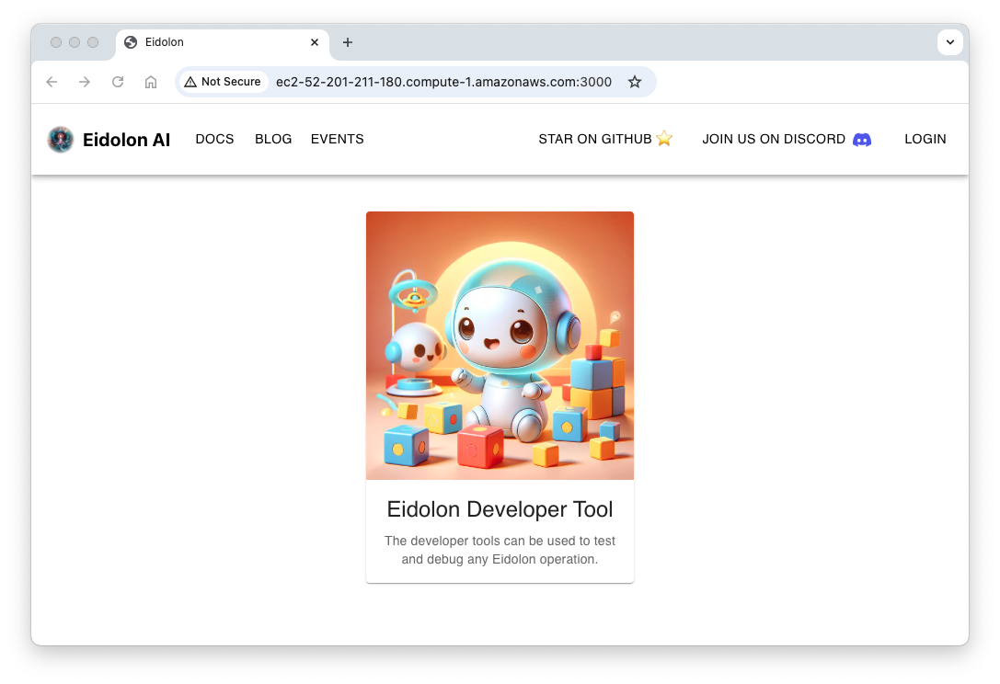
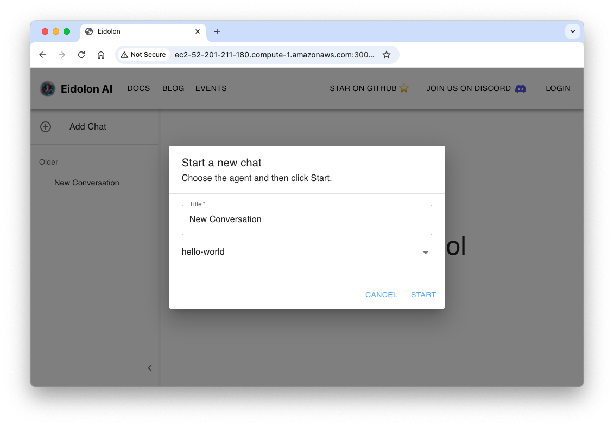

<div>
  <a href="https://github.com/eidolon-ai/eidolon-quickstart">
    
  </a>
  <a href="https://github.com/eidolon-ai/eidolon-quickstart/fork">
    
  </a>
</div>

Welcome to the Eidolon Quickstart! This page covers a few prerequisites, cloning the Quickstart repository from GitHub, starting the agent machine, and conversing with your agent.

## Prerequisites

You don't need much to get started with Eidolon!

1. **OpenAI API Key**
The Quickstart connects to ChatGPT from OpenAI by default. Before continuing, obtain an API key from OpenAI and fund your account. Otherwise you will not be able to authenticate and will receive an error. <br><br>See [LLM Prerequisites](/docs/howto/authenticate_llm) for links to OpenAI and other popular LLM providers.

2. **Docker Engine**
The Quickstart uses Docker to run your agent machine. See <a href="https://docs.docker.com/engine/install/" target=_blank>Install Docker Engine</a> for installation instructions.

## Run Eidolon Quickstart

Running the Eidolon Quickstart requires only that you clone the repository to your machine and run a script.

Use git to clone the quickstart to your local machine:

```bash
git clone https://github.com/eidolon-ai/eidolon-quickstart.git
```

Next run the server in dev mode:

```bash
cd eidolon-quickstart
make docker-serve # or sudo make docker-serve
```

This command downloads dependencies required to run the agent machine and starts Eidolon in "dev-mode". Dev mode provides a local http server and local memory, making it easy to get comfortable with Eidolon functionality.

>🔎 The first time you run this command, you will be prompted to enter the OpenAI API Key, and possibly other credentials. This information is stored in `eidolon-quickstart/.env`.

If the server starts successfully, you should see the following output:

```text title=output
 ✔ Network eidolon-quickstart_default           Created                  0.1s 
 ✔ Container eidolon-quickstart-agent-server-1  Created                  0.1s 
 ✔ Container eidolon-quickstart-webui-1         Created
Attaching to agent-server-1, webui-1
webui-1         |   ▲ Next.js 15.0.0-canary.123
webui-1         |   - Local:        http://xxxx:3000
webui-1         |   - Network:      http://xxx.xx.x.x:3000
webui-1         | 
webui-1         |  ✓ Starting...
webui-1         |  ✓ Ready in 256ms
...
agent-server-1  | INFO - Building machine 'local_dev'
agent-server-1  | INFO - Starting agent 'hello-world'
agent-server-1  | INFO - Collecting anonymous metrics, to disable metrics set DISABLE_ANONYMOUS_METRICS
agent-server-1  | INFO - Server Started in 3.36s
```
You are now up and running with a simple agent! 🎉

🚨 Running into problems? Get help from us on <a href="https://discord.com/invite/6kVQrHpeqG" target=_blank>Discord</a> 📞. We want you to love working with Eidolon, and if there's a problem, we want to fix it.

## Try it out!

Now that Eidolon is running, let's try it out! You can use the WebUI or command line interface (CLI) in a terminal.

### WebUI Developer Tool

A _Developer Tool_ web application is deployed to your server on port 3000. You can use the Developer Tool with any of your Eidolon applications.

To converse with your Eidolon agent for the first time:

1. Open a web browser to http://localhost:3000 (or replace localhost with your server URL).
2. Click the **Eidolon Developer Tool** app card.



3. Click **Add Chat** from the upper left corner.



4. Click **Start**.

5. Say `hello!` to your agent in the text box.

Did your agent respond to you? 🍾 Congratulations! You have successfully created your first agent machine. 

### Command Line Interface (CLI)

 If you prefer to use the CLI, open a new terminal window to interact with your agent.

1. Download the Eidolon CLI.
```bash
pip install 'eidolon-ai-client[cli]' -U
```

2. Create an AgentProcess.
```bash
export PID=$(eidolon-cli processes create --agent hello-world); echo $PID
```
>🔬 _a process defines the boundaries of an agent's memory_

3. Converse with your agent.
```bash
eidolon-cli actions converse --process-id $PID --body "Hi! I made you"
```
## What's Happening?

The repository you  cloned:

- defines an **Agent Machine** 💻 
- with a single **Agent Program** 🤖 
- named `hello-world` 👋
- defined in a YAML file located at `resources/hello_world_agent.yaml`

The agent's YAML file describes:

- how to instantiate your agent from its **Agent Template** 🏭
- including the `system_prompt`, which are instructions to the LLM 
- any customization you might want, such as [swapping out the LLM](/docs/howto/swap_llm), custom tools, etc.

```yaml title=resources/hello-world.yaml
apiVersion: server.eidolonai.com/v1alpha1
kind: Agent
metadata:
  name: hello-world

spec:
  description: "This is an example of a agent using the 'SimpleAgent' template."
  system_prompt: |
    You are a friendly ai agent who was just created by a brilliant developer getting started with Eidolon (great decision). You love emojis and use them liberally.
    Eidolon is an open source framework to build and deploy genAI services (like the one the user is currently interacting with).
    
    Congratulate them on completing the quickstart and recommend that they star the Eidolon [GitHub repoitory](https://eidolonai.com/) to show support and join the project's [discord](https://discord.com/invite/6kVQrHpeqG) for questions and feedback after your first message with them.
```

## Have Fun! Change the System Prompt

To get a taste for how quickly you can deploy powerful agentic applications, make a simple change.

Using a text editor, change the system prompt:

```yaml title=resources/hello-world.yaml
  system_prompt: |
    Repeat the user prompt, then translate the user prompt into Spanish.
```
You do not need to restart. Simply return to the WebUI or CLI and say hello again. Try different prompts and have fun!

## Next Steps
You can adapt this simple agent to do a lot of things! Try these things next.

- [ ] ⭐ [Eidolon](https://github.com/eidolon-ai/eidolon) on GitHub. Eidolon is a fully open source project, and we love your support!
- [ ] [Swap out the LLM](docs/howto/swap_llm)
- [ ] Configure [agent-to-agent communication](/docs/howto/communication)
- [ ] Configure [built-in components](/docs/howto/configure_builtins)
- [ ] Use [structured inputs](docs/components/agents/simpleagent#3-property-system_prompt) for prompt templating
- [ ] Leverage your agent's [state machine](/docs/components/agents/simpleagent#51-actiondefinition)
- [ ] Add new capabilities via [LogicUnits](/category/logicunit) (tools)
